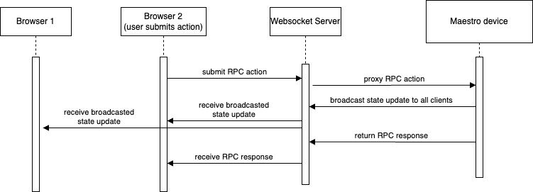
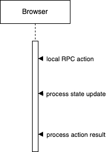

## Deployment contexts

A Springboard application can be deployed and run in multiple ways. When developing feature-level code, you don't need to be concerned with the complexities of the deployment. The framework abstracts this away, so that feature-level code can be agnostic to the deployment context.

The below diagrams are meant to illustrate _how_ the deployments work. An application deployment can be multi-player-only, single-player-only, or a hybrid where the user swaps between contexts.

### Multi-player

The framework helps facilitate realtime communication between clients behind-the-scenes using [WebSockets](https://en.wikipedia.org/wiki/WebSocket) and [JSON-RPC](https://en.wikipedia.org/wiki/JSON-RPC#Version_2.0). By defining Actions and States in your application, user actions are sent to the correct device to process the action, and any shared state that changes from the action is automatically synchronized across devices in realtime.

### Single-player

In the single-player (or local-only) mode, all code runs locally, and any data storage happens locally. This allows for flexibility of how an application is used. When the user chooses to go local-only, the browser must be refreshed to process the change. This may not be a requirement in the future.

